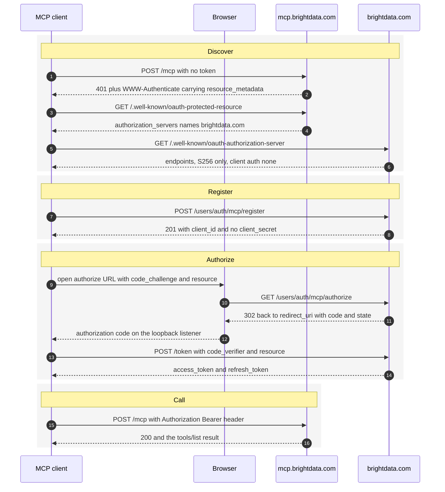

> ## Documentation Index
> Fetch the complete documentation index at: https://docs.brightdata.com/llms.txt
> Use this file to discover all available pages before exploring further.

# Bright Data MCP OAuth 2.1 setup

> Authenticate agents to the Bright Data MCP server with OAuth 2.1: discovery metadata, mandatory PKCE S256, dynamic client registration and scoped tokens.

This guide shows you how to authenticate an MCP client to the Bright Data MCP server with OAuth 2.1, so a user signs in through a browser instead of pasting a Bright Data API key into a config file.

The Bright Data MCP server at `https://mcp.brightdata.com` is an OAuth 2.1 protected resource. It advertises its authorization server through RFC 9728 discovery metadata, and any MCP client that implements the Model Context Protocol authorization spec can connect without hardcoded credentials. The authorization server is `https://brightdata.com`.

Four requirements are enforced on every request. Get these wrong and the flow fails before a token is ever issued:

1. **PKCE with `S256` is mandatory.** The `plain` method is rejected.
2. **The `resource` parameter is mandatory** on both the authorization request and the token request, per RFC 8707.
3. **Clients are public.** The token endpoint accepts `token_endpoint_auth_method: none`, so there is no client secret.
4. **The only scope is `mcp`.**

## Which authentication methods does the Bright Data MCP server support?

The Bright Data MCP server accepts two authentication methods. Both reach the same tools and draw on the same account credits.

| Method    | How the credential is sent                                  | Best for                                                                               |
| --------- | ----------------------------------------------------------- | -------------------------------------------------------------------------------------- |
| API key   | `?token=YOUR_API_TOKEN` query parameter on `/mcp` or `/sse` | Server-side agents, CI jobs and scripts you control end to end                         |
| OAuth 2.1 | `Authorization: Bearer <access_token>` request header       | Distributed MCP clients, desktop assistants and any app used by someone who is not you |

The API key method is documented in the [remote MCP server quickstart](/ai/mcp-server/remote/quickstart). Use OAuth 2.1 when the person running the client is not the person who owns the Bright Data account, or when you do not want a long-lived key sitting in a config file.

## Prerequisites

Before you start, make sure you have:

* A [Bright Data account](https://brightdata.com/?hs_signup=1\&utm_source=docs). New accounts include 5,000 free requests per month.
* An MCP client that implements the Model Context Protocol authorization spec, or your own OAuth 2.1 client code.
* A redirect URI you control. Loopback addresses such as `http://localhost:8765/callback` are accepted for native and desktop clients.

## How to run the OAuth 2.1 authorization code flow

The flow spans two hosts. `mcp.brightdata.com` holds the tools, `brightdata.com` issues the tokens, and the user's browser enters only during authorization.



<Steps>
  <Step title="Trigger the 401 challenge">
    Call the MCP endpoint without a token. The Bright Data MCP server returns `401 Unauthorized` with a `WWW-Authenticate` header that points at its protected resource metadata.

    ```bash theme={null}
    curl -i -X POST https://mcp.brightdata.com/mcp \
      -H 'Content-Type: application/json' \
      -H 'Accept: application/json, text/event-stream' \
      -d '{"jsonrpc":"2.0","id":1,"method":"initialize","params":{"protocolVersion":"2025-06-18","capabilities":{},"clientInfo":{"name":"my-client","version":"1.0.0"}}}'
    ```

    The response header is the entry point to the whole flow:

    ```http theme={null}
    HTTP/2 401
    www-authenticate: Bearer resource_metadata="https://mcp.brightdata.com/.well-known/oauth-protected-resource", scope="mcp"
    ```

    Parse `resource_metadata` from this header rather than hardcoding the URL. That is what makes the client portable across MCP servers.
  </Step>

  <Step title="Fetch the protected resource metadata">
    Request the URL from the `resource_metadata` parameter to learn which authorization server issues tokens for this resource.

    ```bash theme={null}
    curl -s https://mcp.brightdata.com/.well-known/oauth-protected-resource
    ```

    ```json theme={null}
    {
      "resource": "https://mcp.brightdata.com",
      "authorization_servers": ["https://brightdata.com"],
      "scopes_supported": ["mcp"],
      "bearer_methods_supported": ["header"]
    }
    ```

    Two values matter downstream. The `resource` value is what you send as the `resource` parameter in steps 4 and 5. The single entry in `authorization_servers` is the issuer you query in step 3.
  </Step>

  <Step title="Fetch the authorization server metadata">
    Request the RFC 8414 metadata document from the issuer to get the endpoint URLs and the server's capabilities.

    ```bash theme={null}
    curl -s https://brightdata.com/.well-known/oauth-authorization-server
    ```

    ```json theme={null}
    {
      "issuer": "https://brightdata.com",
      "authorization_endpoint": "https://brightdata.com/users/auth/mcp/authorize",
      "token_endpoint": "https://brightdata.com/users/auth/mcp/token",
      "registration_endpoint": "https://brightdata.com/users/auth/mcp/register",
      "jwks_uri": "https://brightdata.com/users/auth/mcp/jwks",
      "response_types_supported": ["code"],
      "grant_types_supported": ["authorization_code", "refresh_token"],
      "code_challenge_methods_supported": ["S256"],
      "token_endpoint_auth_methods_supported": ["none"],
      "scopes_supported": ["mcp"],
      "resource_parameter_supported": true
    }
    ```

    Read the endpoint URLs from this document. Do not hardcode them, because a discovery-driven client keeps working if an endpoint path changes.
  </Step>

  <Step title="Register a client">
    Register once with the RFC 7591 dynamic client registration endpoint to get a `client_id`. Registration is open, so no existing credential is needed.

    ```bash theme={null}
    curl -s -X POST https://brightdata.com/users/auth/mcp/register \
      -H 'Content-Type: application/json' \
      -d '{
        "client_name": "My MCP Client",
        "redirect_uris": ["http://localhost:8765/callback"],
        "grant_types": ["authorization_code", "refresh_token"],
        "response_types": ["code"],
        "token_endpoint_auth_method": "none",
        "scope": "mcp"
      }'
    ```

    The server responds with `201 Created`:

    ```json theme={null}
    {
      "client_id": "dIaOwFk5ge6QYbqN_V0lglzqRv2Pth6c",
      "client_id_issued_at": 1787574414,
      "client_name": "My MCP Client",
      "redirect_uris": ["http://localhost:8765/callback"],
      "grant_types": ["authorization_code", "refresh_token"],
      "response_types": ["code"],
      "token_endpoint_auth_method": "none",
      "scope": "mcp"
    }
    ```

    No `client_secret` is returned, because clients are public. Store the `client_id` and reuse it. Every `redirect_uri` you plan to use has to be listed at registration time, since an unregistered redirect URI is rejected with `400 Bad Request`.
  </Step>

  <Step title="Send the user to the authorization endpoint">
    Generate a PKCE verifier and challenge, then open the authorization URL in the user's browser.

    ```python theme={null}
    import base64, hashlib, secrets, urllib.parse

    verifier = base64.urlsafe_b64encode(secrets.token_bytes(32)).decode().rstrip("=")
    challenge = base64.urlsafe_b64encode(
        hashlib.sha256(verifier.encode()).digest()
    ).decode().rstrip("=")
    state = secrets.token_urlsafe(16)

    params = {
        "response_type": "code",
        "client_id": "dIaOwFk5ge6QYbqN_V0lglzqRv2Pth6c",
        "redirect_uri": "http://localhost:8765/callback",
        "scope": "mcp",
        "state": state,
        "code_challenge": challenge,
        "code_challenge_method": "S256",
        "resource": "https://mcp.brightdata.com",
    }
    url = "https://brightdata.com/users/auth/mcp/authorize?" + urllib.parse.urlencode(params)
    print(url)
    ```

    Keep the `verifier` in memory for step 6 and keep the `state` value so you can compare it against the value that comes back. If the user is not signed in, the authorization endpoint redirects to `https://brightdata.com/cp/start?mcp=1&need_login=1&next=...` and returns to the flow after sign-in.

    After the user approves, the browser is redirected to your `redirect_uri` with the authorization code:

    ```text theme={null}
    http://localhost:8765/callback?code=AUTH_CODE_HERE&state=STATE_FROM_ABOVE
    ```

    Reject the response if `state` does not match the value you sent.
  </Step>

  <Step title="Exchange the code for an access token">
    Post the code, the PKCE verifier and the `resource` value to the token endpoint. All five parameters are required.

    ```bash theme={null}
    curl -s -X POST https://brightdata.com/users/auth/mcp/token \
      -H 'Content-Type: application/x-www-form-urlencoded' \
      -d 'grant_type=authorization_code' \
      -d 'code=AUTH_CODE_HERE' \
      -d 'client_id=dIaOwFk5ge6QYbqN_V0lglzqRv2Pth6c' \
      -d 'redirect_uri=http://localhost:8765/callback' \
      -d 'code_verifier=YOUR_PKCE_VERIFIER' \
      -d 'resource=https://mcp.brightdata.com'
    ```

    Send the returned access token as a bearer header on every MCP request. The protected resource metadata lists `header` as the only supported bearer method, so a token in a query string is not accepted.

    ```bash theme={null}
    curl -X POST https://mcp.brightdata.com/mcp \
      -H 'Authorization: Bearer ACCESS_TOKEN_HERE' \
      -H 'Content-Type: application/json' \
      -H 'Accept: application/json, text/event-stream' \
      -d '{"jsonrpc":"2.0","id":1,"method":"tools/list","params":{}}'
    ```
  </Step>
</Steps>

## OAuth 2.1 endpoint reference

| Purpose                                  | URL                                                               |
| ---------------------------------------- | ----------------------------------------------------------------- |
| Protected resource metadata (RFC 9728)   | `https://mcp.brightdata.com/.well-known/oauth-protected-resource` |
| Authorization server metadata (RFC 8414) | `https://brightdata.com/.well-known/oauth-authorization-server`   |
| Authorization                            | `https://brightdata.com/users/auth/mcp/authorize`                 |
| Token                                    | `https://brightdata.com/users/auth/mcp/token`                     |
| Dynamic client registration (RFC 7591)   | `https://brightdata.com/users/auth/mcp/register`                  |
| JSON Web Key Set                         | `https://brightdata.com/users/auth/mcp/jwks`                      |

<Note>
  The authorization server metadata is also served from `https://mcp.brightdata.com/.well-known/oauth-authorization-server`, and the protected resource metadata is also served from the path-insertion variant `https://mcp.brightdata.com/.well-known/oauth-protected-resource/mcp`. Clients that probe either location resolve correctly.
</Note>

<Warning>
  The two copies of the authorization server metadata are not identical. The copy served from `https://brightdata.com` includes `"resource_parameter_supported": true`. The copy served from `https://mcp.brightdata.com` omits that field, even though the server rejects any authorization or token request that arrives without a `resource` parameter. Read the copy at the issuer root, `https://brightdata.com/.well-known/oauth-authorization-server`, which is the location RFC 8414 specifies and the only one that advertises the requirement.
</Warning>

## What does the authorization server enforce?

The Bright Data authorization server rejects requests that do not meet these five rules. The error strings below are returned verbatim, which makes them useful assertions in a test suite.

| Rule                                     | Rejected request                               | Response                                                                                                            |
| ---------------------------------------- | ---------------------------------------------- | ------------------------------------------------------------------------------------------------------------------- |
| PKCE is required                         | Authorization request with no `code_challenge` | `invalid_request`, `Missing required parameter: code_challenge`                                                     |
| Only `S256` is accepted                  | `code_challenge_method=plain`                  | `invalid_request`, `Unsupported code_challenge_method; only S256 is supported`                                      |
| `resource` is required                   | Authorization request with no `resource`       | `invalid_request`, `resource parameter is required (RFC 8707)`                                                      |
| `resource` is required on token exchange | Token request with no `resource`               | `invalid_request`, `Missing or invalid required parameters: code, code_verifier, redirect_uri, client_id, resource` |
| Only two grant types                     | `grant_type=client_credentials`                | `unsupported_grant_type`, `Supported grant types: authorization_code, refresh_token`                                |

Two failures are returned as `400 Bad Request` without a redirect, which is the behavior the OAuth 2.0 Security Best Current Practice prescribes so that an attacker cannot use the authorization server as an open redirector:

* An unknown `client_id`.
* A `redirect_uri` that was not registered for that `client_id`.

## How to handle 401 responses and refresh tokens

Treat any `401` from `https://mcp.brightdata.com` as the signal to refresh, then retry the request once. Do not schedule refreshes against a hardcoded lifetime, because the `WWW-Authenticate` challenge is the authoritative signal.

Request a new access token with the `refresh_token` grant. The `resource` parameter is required here too:

```bash theme={null}
curl -s -X POST https://brightdata.com/users/auth/mcp/token \
  -H 'Content-Type: application/x-www-form-urlencoded' \
  -d 'grant_type=refresh_token' \
  -d 'refresh_token=YOUR_REFRESH_TOKEN' \
  -d 'client_id=dIaOwFk5ge6QYbqN_V0lglzqRv2Pth6c' \
  -d 'resource=https://mcp.brightdata.com'
```

If the refresh token is itself invalid or already used, the server returns `invalid_grant` with the description `Invalid, expired, or already used refresh token`. Send the user back through the authorization flow in step 5 when that happens.

## How to test your OAuth 2.1 integration

Verify discovery and enforcement with `curl` before you write any client code. None of these checks need a token or a browser.

Confirm the server challenges an unauthenticated request:

```bash theme={null}
curl -si -X POST https://mcp.brightdata.com/mcp \
  -H 'Content-Type: application/json' \
  -H 'Accept: application/json, text/event-stream' \
  -d '{"jsonrpc":"2.0","id":1,"method":"initialize","params":{"protocolVersion":"2025-06-18","capabilities":{},"clientInfo":{"name":"t","version":"1.0.0"}}}' \
  | grep -i 'www-authenticate'
```

Expected output:

```text theme={null}
www-authenticate: Bearer resource_metadata="https://mcp.brightdata.com/.well-known/oauth-protected-resource", scope="mcp"
```

Confirm that PKCE and the `resource` parameter are enforced. Both requests return a redirect carrying an OAuth error, so no token is issued:

```bash theme={null}
CLIENT_ID=your_client_id_here
AUTH=https://brightdata.com/users/auth/mcp/authorize
BASE="response_type=code&client_id=$CLIENT_ID&redirect_uri=http%3A%2F%2Flocalhost%3A8765%2Fcallback&scope=mcp&state=test"

# No code_challenge: expect Missing required parameter: code_challenge
curl -s -o /dev/null -w '%{redirect_url}\n' "$AUTH?$BASE&resource=https%3A%2F%2Fmcp.brightdata.com"

# No resource: expect resource parameter is required (RFC 8707)
curl -s -o /dev/null -w '%{redirect_url}\n' "$AUTH?$BASE&code_challenge=E9Melhoa2OwvFrEMTJguCHaoeK1t8URWbuGJSstw-cM&code_challenge_method=S256"
```

Once the flow works end to end, add these four assertions to your client's test suite so a regression fails the build:

1. A request with no token returns `401` and a `WWW-Authenticate` header containing `resource_metadata`.
2. A request with a valid bearer token returns a `tools/list` result with a non-empty `tools` array.
3. A request with a deliberately corrupted bearer token returns `401`, not `200`.
4. The `state` value returned to your redirect URI matches the value your client sent.

## Troubleshooting OAuth 2.1 errors

| Error                                                       | Cause                                                                                                             | Fix                                                                                                                                                                     |
| ----------------------------------------------------------- | ----------------------------------------------------------------------------------------------------------------- | ----------------------------------------------------------------------------------------------------------------------------------------------------------------------- |
| `Missing required parameter: code_challenge`                | The authorization request omitted PKCE                                                                            | Generate a verifier, send its SHA-256 hash as `code_challenge` with `code_challenge_method=S256`                                                                        |
| `Unsupported code_challenge_method; only S256 is supported` | The client sent `plain`                                                                                           | Switch to `S256`. `plain` is not accepted                                                                                                                               |
| `resource parameter is required (RFC 8707)`                 | The authorization request omitted `resource`                                                                      | Add `resource=https://mcp.brightdata.com`                                                                                                                               |
| `Missing or invalid required parameters: ...`               | The token request is missing one of `code`, `code_verifier`, `redirect_uri`, `client_id` or `resource`            | Send all five. `resource` is the one most clients forget                                                                                                                |
| `Invalid, expired, or already used code`                    | The authorization code was reused, expired or paired with the wrong verifier                                      | Restart the authorization flow. Codes are single use                                                                                                                    |
| `unsupported_grant_type`                                    | The client tried a grant other than `authorization_code` or `refresh_token`                                       | Use the authorization code flow. Client credentials are not supported                                                                                                   |
| `400 Bad Request` with no redirect                          | Unknown `client_id`, or a `redirect_uri` that was not registered                                                  | Register the client, and list every redirect URI you use at registration time                                                                                           |
| `401` on `/mcp` with a token that used to work              | The access token expired                                                                                          | Refresh with the `refresh_token` grant, then retry the request once                                                                                                     |
| `403 Forbidden` with an HTML body and no OAuth error        | The client sent the Python standard library default User-Agent (`Python-urllib/*`), which `brightdata.com` blocks | Set an explicit `User-Agent` header on every request to the authorization server. Clients using `requests`, `httpx`, `aiohttp`, Node, Go, Java or okhttp are unaffected |

## FAQ

### Do I have to migrate from API keys to OAuth 2.1?

No. The `?token=YOUR_API_TOKEN` query parameter on `https://mcp.brightdata.com/mcp` and `https://mcp.brightdata.com/sse` continues to work. OAuth 2.1 is an additional method, not a replacement.

### Which scope should I request?

Request `mcp`. It is the only scope the Bright Data MCP server publishes in `scopes_supported`, on both the protected resource metadata and the authorization server metadata.

### Is a client secret required?

No. The authorization server publishes `token_endpoint_auth_methods_supported: ["none"]`, so Bright Data MCP clients are public clients. PKCE, not a secret, is what binds the authorization code to the client that requested it.

### Can I skip dynamic client registration and use a preconfigured client ID?

Dynamic client registration at `https://brightdata.com/users/auth/mcp/register` is the supported path, and it is open, so any client can register itself without a credential. Register once and store the returned `client_id` rather than registering on every launch.

### Why does my Python client get a 403 instead of an OAuth error?

Set an explicit `User-Agent` header. Requests to `https://brightdata.com` that carry the Python standard library default User-Agent (`Python-urllib/*`) are rejected with `403 Forbidden` before they reach the authorization server, so no OAuth error body comes back to explain the failure.

The rejection matches on the User-Agent string alone. An identical client sending an identical request over the same TLS connection succeeds as soon as the header changes, so no other property of the client is involved. Verified against `https://brightdata.com/.well-known/oauth-authorization-server` and the registration endpoint:

| Client                           | User-Agent sent             | Result          |
| -------------------------------- | --------------------------- | --------------- |
| `requests` 2.32.5                | `python-requests/2.32.5`    | `200` and `201` |
| `urllib3` 2.4.0                  | urllib3 default             | `200` and `201` |
| `aiohttp` 3.13.5                 | `Python/3.9 aiohttp/3.13.5` | `200` and `201` |
| `urllib` (standard library)      | `Python-urllib/3.9`         | `403` and `403` |
| `urllib` with an explicit header | `my-mcp-client/1.0`         | `200` and `201` |

Only the Python standard library default is affected. Clients built on `requests`, `httpx`, `aiohttp`, Node, Go, Java or okhttp send their own User-Agent and need no change.

```python theme={null}
import urllib.request

req = urllib.request.Request(
    "https://brightdata.com/.well-known/oauth-authorization-server",
    headers={"User-Agent": "my-mcp-client/1.0"},
)
with urllib.request.urlopen(req) as response:
    metadata = response.read()
```

### Which MCP transports support OAuth 2.1?

Both. The Streamable HTTP endpoint `https://mcp.brightdata.com/mcp` and the SSE endpoint `https://mcp.brightdata.com/sse` return the same `401` challenge and accept the same bearer token.

<Card title="Remote MCP server advanced configuration" icon="sliders" href="/ai/mcp-server/remote/advanced" cta="Configure tools and zones">
  Select tool groups, switch zones and tune the remote Bright Data MCP server.
</Card>
