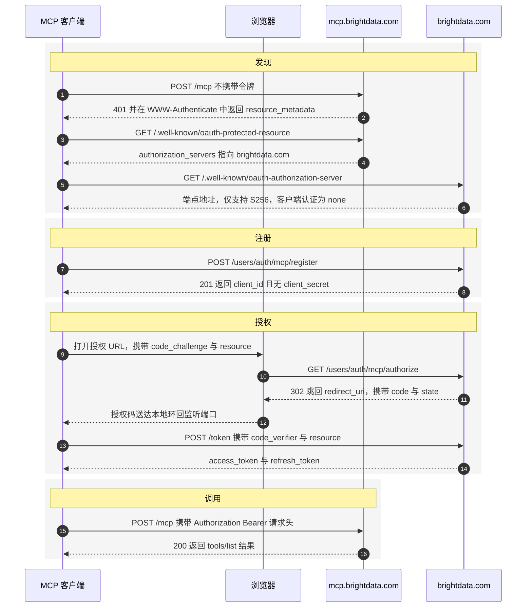

> ## Documentation Index
> Fetch the complete documentation index at: https://docs.brightdata.com/llms.txt
> Use this file to discover all available pages before exploring further.

# Bright Data MCP OAuth 2.1 配置

> 使用 OAuth 2.1 为 AI 智能体连接 Bright Data MCP 服务器，涵盖发现元数据、强制 PKCE S256、动态客户端注册与作用域令牌。

本指南介绍如何使用 OAuth 2.1 将 MCP 客户端连接到 Bright Data MCP 服务器，让用户通过浏览器登录，而不必将 Bright Data API 密钥粘贴到配置文件中。

位于 `https://mcp.brightdata.com` 的 Bright Data MCP 服务器是一个 OAuth 2.1 受保护资源。该服务器通过 RFC 9728 发现元数据公布其授权服务器地址，任何实现了 Model Context Protocol 授权规范的 MCP 客户端都可以在无需硬编码凭据的情况下连接。授权服务器为 `https://brightdata.com`。

服务器对每个请求强制执行以下四项要求。任何一项不满足，流程都会在颁发令牌之前失败：

1. **必须使用 PKCE 且方法为 `S256`**，`plain` 方法会被拒绝。
2. **必须携带 `resource` 参数**，授权请求与令牌请求均需携带，依据 RFC 8707。
3. **客户端为公开客户端**。令牌端点接受 `token_endpoint_auth_method: none`，因此不存在客户端密钥。
4. **唯一可用的作用域是 `mcp`**。

## Bright Data MCP 服务器支持哪些认证方式？

Bright Data MCP 服务器支持两种认证方式。两者可访问相同的工具，并消耗同一账户的额度。

| 方式        | 凭据传递位置                                          | 适用场景                        |
| --------- | ----------------------------------------------- | --------------------------- |
| API 密钥    | `/mcp` 或 `/sse` 上的 `?token=YOUR_API_TOKEN` 查询参数 | 服务端智能体、CI 任务以及您完全掌控的脚本      |
| OAuth 2.1 | `Authorization: Bearer <access_token>` 请求头      | 分发式 MCP 客户端、桌面助手，以及由他人使用的应用 |

API 密钥方式请参见[远程 MCP 服务器快速开始](/cn/ai/mcp-server/remote/quickstart)。当运行客户端的人并非 Bright Data 账户所有者，或者您不希望长期有效的密钥留在配置文件中时，请使用 OAuth 2.1。

## 前置条件

开始之前，请确保您已准备好以下内容：

* 一个 [Bright Data 账户](https://brightdata.com/?hs_signup=1\&utm_source=docs)。新账户每月包含 5,000 次免费请求。
* 一个实现了 Model Context Protocol 授权规范的 MCP 客户端，或您自己的 OAuth 2.1 客户端代码。
* 一个由您控制的重定向 URI。桌面与本地客户端可使用 `http://localhost:8765/callback` 这类环回地址。

## 如何执行 OAuth 2.1 授权码流程

该流程跨越两个主机。`mcp.brightdata.com` 提供工具，`brightdata.com` 颁发令牌，用户浏览器仅在授权阶段介入。



<Steps>
  <Step title="触发 401 质询">
    在不携带令牌的情况下调用 MCP 端点。Bright Data MCP 服务器会返回 `401 Unauthorized`，并在 `WWW-Authenticate` 响应头中指向其受保护资源元数据。

    ```bash theme={null}
    curl -i -X POST https://mcp.brightdata.com/mcp \
      -H 'Content-Type: application/json' \
      -H 'Accept: application/json, text/event-stream' \
      -d '{"jsonrpc":"2.0","id":1,"method":"initialize","params":{"protocolVersion":"2025-06-18","capabilities":{},"clientInfo":{"name":"my-client","version":"1.0.0"}}}'
    ```

    该响应头是整个流程的入口：

    ```http theme={null}
    HTTP/2 401
    www-authenticate: Bearer resource_metadata="https://mcp.brightdata.com/.well-known/oauth-protected-resource", scope="mcp"
    ```

    请从该响应头中解析 `resource_metadata`，而不要硬编码该 URL。这样客户端才能在不同 MCP 服务器之间通用。
  </Step>

  <Step title="获取受保护资源元数据">
    请求 `resource_metadata` 参数中的 URL，以确定由哪个授权服务器为该资源颁发令牌。

    ```bash theme={null}
    curl -s https://mcp.brightdata.com/.well-known/oauth-protected-resource
    ```

    ```json theme={null}
    {
      "resource": "https://mcp.brightdata.com",
      "authorization_servers": ["https://brightdata.com"],
      "scopes_supported": ["mcp"],
      "bearer_methods_supported": ["header"]
    }
    ```

    其中两个值在后续步骤中会用到。`resource` 的值即为第 4 步与第 5 步中要发送的 `resource` 参数。`authorization_servers` 中唯一的条目就是第 3 步要查询的颁发者。
  </Step>

  <Step title="获取授权服务器元数据">
    向颁发者请求 RFC 8414 元数据文档，获取端点地址与服务器能力。

    ```bash theme={null}
    curl -s https://brightdata.com/.well-known/oauth-authorization-server
    ```

    ```json theme={null}
    {
      "issuer": "https://brightdata.com",
      "authorization_endpoint": "https://brightdata.com/users/auth/mcp/authorize",
      "token_endpoint": "https://brightdata.com/users/auth/mcp/token",
      "registration_endpoint": "https://brightdata.com/users/auth/mcp/register",
      "jwks_uri": "https://brightdata.com/users/auth/mcp/jwks",
      "response_types_supported": ["code"],
      "grant_types_supported": ["authorization_code", "refresh_token"],
      "code_challenge_methods_supported": ["S256"],
      "token_endpoint_auth_methods_supported": ["none"],
      "scopes_supported": ["mcp"],
      "resource_parameter_supported": true
    }
    ```

    请从该文档读取端点地址，不要硬编码。基于发现机制的客户端在端点路径变更后仍可继续工作。
  </Step>

  <Step title="注册客户端">
    通过 RFC 7591 动态客户端注册端点注册一次，即可获得 `client_id`。该端点开放注册，无需任何已有凭据。

    ```bash theme={null}
    curl -s -X POST https://brightdata.com/users/auth/mcp/register \
      -H 'Content-Type: application/json' \
      -d '{
        "client_name": "My MCP Client",
        "redirect_uris": ["http://localhost:8765/callback"],
        "grant_types": ["authorization_code", "refresh_token"],
        "response_types": ["code"],
        "token_endpoint_auth_method": "none",
        "scope": "mcp"
      }'
    ```

    服务器返回 `201 Created`：

    ```json theme={null}
    {
      "client_id": "dIaOwFk5ge6QYbqN_V0lglzqRv2Pth6c",
      "client_id_issued_at": 1787574414,
      "client_name": "My MCP Client",
      "redirect_uris": ["http://localhost:8765/callback"],
      "grant_types": ["authorization_code", "refresh_token"],
      "response_types": ["code"],
      "token_endpoint_auth_method": "none",
      "scope": "mcp"
    }
    ```

    响应中不包含 `client_secret`，因为客户端为公开客户端。请保存并复用该 `client_id`。所有计划使用的 `redirect_uri` 都必须在注册时一并列出，未注册的重定向 URI 会被以 `400 Bad Request` 拒绝。
  </Step>

  <Step title="将用户引导至授权端点">
    生成 PKCE verifier 与 challenge，然后在用户浏览器中打开授权 URL。

    ```python theme={null}
    import base64, hashlib, secrets, urllib.parse

    verifier = base64.urlsafe_b64encode(secrets.token_bytes(32)).decode().rstrip("=")
    challenge = base64.urlsafe_b64encode(
        hashlib.sha256(verifier.encode()).digest()
    ).decode().rstrip("=")
    state = secrets.token_urlsafe(16)

    params = {
        "response_type": "code",
        "client_id": "dIaOwFk5ge6QYbqN_V0lglzqRv2Pth6c",
        "redirect_uri": "http://localhost:8765/callback",
        "scope": "mcp",
        "state": state,
        "code_challenge": challenge,
        "code_challenge_method": "S256",
        "resource": "https://mcp.brightdata.com",
    }
    url = "https://brightdata.com/users/auth/mcp/authorize?" + urllib.parse.urlencode(params)
    print(url)
    ```

    请在内存中保留 `verifier` 供第 6 步使用，并保留 `state` 值以便与回调返回的值比对。如果用户尚未登录，授权端点会重定向到 `https://brightdata.com/cp/start?mcp=1&need_login=1&next=...`，登录完成后返回原流程。

    用户批准后，浏览器会携带授权码重定向到您的 `redirect_uri`：

    ```text theme={null}
    http://localhost:8765/callback?code=AUTH_CODE_HERE&state=STATE_FROM_ABOVE
    ```

    如果返回的 `state` 与您发送的值不一致，请拒绝该响应。
  </Step>

  <Step title="用授权码换取访问令牌">
    向令牌端点提交授权码、PKCE verifier 与 `resource` 值。以下五个参数缺一不可。

    ```bash theme={null}
    curl -s -X POST https://brightdata.com/users/auth/mcp/token \
      -H 'Content-Type: application/x-www-form-urlencoded' \
      -d 'grant_type=authorization_code' \
      -d 'code=AUTH_CODE_HERE' \
      -d 'client_id=dIaOwFk5ge6QYbqN_V0lglzqRv2Pth6c' \
      -d 'redirect_uri=http://localhost:8765/callback' \
      -d 'code_verifier=YOUR_PKCE_VERIFIER' \
      -d 'resource=https://mcp.brightdata.com'
    ```

    之后在每个 MCP 请求中通过 Bearer 请求头发送该访问令牌。受保护资源元数据中 `bearer_methods_supported` 仅列出 `header`，因此放在查询字符串中的令牌不会被接受。

    ```bash theme={null}
    curl -X POST https://mcp.brightdata.com/mcp \
      -H 'Authorization: Bearer ACCESS_TOKEN_HERE' \
      -H 'Content-Type: application/json' \
      -H 'Accept: application/json, text/event-stream' \
      -d '{"jsonrpc":"2.0","id":1,"method":"tools/list","params":{}}'
    ```
  </Step>
</Steps>

## OAuth 2.1 端点参考

| 用途                 | 地址                                                                |
| ------------------ | ----------------------------------------------------------------- |
| 受保护资源元数据（RFC 9728） | `https://mcp.brightdata.com/.well-known/oauth-protected-resource` |
| 授权服务器元数据（RFC 8414） | `https://brightdata.com/.well-known/oauth-authorization-server`   |
| 授权                 | `https://brightdata.com/users/auth/mcp/authorize`                 |
| 令牌                 | `https://brightdata.com/users/auth/mcp/token`                     |
| 动态客户端注册（RFC 7591）  | `https://brightdata.com/users/auth/mcp/register`                  |
| JSON Web 密钥集       | `https://brightdata.com/users/auth/mcp/jwks`                      |

<Note>
  授权服务器元数据同时也可从 `https://mcp.brightdata.com/.well-known/oauth-authorization-server` 获取，受保护资源元数据同时也可从路径插入变体 `https://mcp.brightdata.com/.well-known/oauth-protected-resource/mcp` 获取。探测任一地址的客户端都能正确解析。
</Note>

<Warning>
  授权服务器元数据的两份副本并不一致。`https://brightdata.com` 提供的副本包含 `"resource_parameter_supported": true`，而 `https://mcp.brightdata.com` 提供的副本缺少该字段，尽管服务器会拒绝任何未携带 `resource` 参数的授权请求与令牌请求。请读取颁发者根路径下的副本 `https://brightdata.com/.well-known/oauth-authorization-server`，这是 RFC 8414 规定的位置，也是唯一公布该项要求的副本。
</Warning>

## 授权服务器强制执行哪些规则？

Bright Data 授权服务器会拒绝不满足以下五条规则的请求。下表中的错误信息为原样返回，可直接用作测试断言。

| 规则                  | 被拒绝的请求                          | 响应                                                                                                                 |
| ------------------- | ------------------------------- | ------------------------------------------------------------------------------------------------------------------ |
| 必须使用 PKCE           | 授权请求未携带 `code_challenge`        | `invalid_request`，`Missing required parameter: code_challenge`                                                     |
| 仅接受 `S256`          | `code_challenge_method=plain`   | `invalid_request`，`Unsupported code_challenge_method; only S256 is supported`                                      |
| 必须携带 `resource`     | 授权请求未携带 `resource`              | `invalid_request`，`resource parameter is required (RFC 8707)`                                                      |
| 令牌请求必须携带 `resource` | 令牌请求未携带 `resource`              | `invalid_request`，`Missing or invalid required parameters: code, code_verifier, redirect_uri, client_id, resource` |
| 仅支持两种授权类型           | `grant_type=client_credentials` | `unsupported_grant_type`，`Supported grant types: authorization_code, refresh_token`                                |

以下两种失败会返回 `400 Bad Request` 且不进行重定向，这符合 OAuth 2.0 安全最佳实践的要求，可防止攻击者将授权服务器用作开放重定向器：

* 未知的 `client_id`。
* 未为该 `client_id` 注册的 `redirect_uri`。

## 如何处理 401 响应与刷新令牌

请将来自 `https://mcp.brightdata.com` 的任何 `401` 视为刷新信号，刷新后重试该请求一次。不要按照硬编码的有效期安排刷新，因为 `WWW-Authenticate` 质询才是权威信号。

使用 `refresh_token` 授权类型申请新的访问令牌。此处同样必须携带 `resource` 参数：

```bash theme={null}
curl -s -X POST https://brightdata.com/users/auth/mcp/token \
  -H 'Content-Type: application/x-www-form-urlencoded' \
  -d 'grant_type=refresh_token' \
  -d 'refresh_token=YOUR_REFRESH_TOKEN' \
  -d 'client_id=dIaOwFk5ge6QYbqN_V0lglzqRv2Pth6c' \
  -d 'resource=https://mcp.brightdata.com'
```

如果刷新令牌本身无效或已被使用，服务器会返回 `invalid_grant`，描述为 `Invalid, expired, or already used refresh token`。此时请让用户重新执行第 5 步的授权流程。

## 如何测试 OAuth 2.1 集成

在编写客户端代码之前，先用 `curl` 验证发现机制与强制规则。以下检查均无需令牌或浏览器。

确认服务器会对未认证请求发出质询：

```bash theme={null}
curl -si -X POST https://mcp.brightdata.com/mcp \
  -H 'Content-Type: application/json' \
  -H 'Accept: application/json, text/event-stream' \
  -d '{"jsonrpc":"2.0","id":1,"method":"initialize","params":{"protocolVersion":"2025-06-18","capabilities":{},"clientInfo":{"name":"t","version":"1.0.0"}}}' \
  | grep -i 'www-authenticate'
```

预期输出：

```text theme={null}
www-authenticate: Bearer resource_metadata="https://mcp.brightdata.com/.well-known/oauth-protected-resource", scope="mcp"
```

确认 PKCE 与 `resource` 参数已被强制执行。以下两个请求都会返回携带 OAuth 错误的重定向，不会颁发任何令牌：

```bash theme={null}
CLIENT_ID=your_client_id_here
AUTH=https://brightdata.com/users/auth/mcp/authorize
BASE="response_type=code&client_id=$CLIENT_ID&redirect_uri=http%3A%2F%2Flocalhost%3A8765%2Fcallback&scope=mcp&state=test"

# 缺少 code_challenge：预期 Missing required parameter: code_challenge
curl -s -o /dev/null -w '%{redirect_url}\n' "$AUTH?$BASE&resource=https%3A%2F%2Fmcp.brightdata.com"

# 缺少 resource：预期 resource parameter is required (RFC 8707)
curl -s -o /dev/null -w '%{redirect_url}\n' "$AUTH?$BASE&code_challenge=E9Melhoa2OwvFrEMTJguCHaoeK1t8URWbuGJSstw-cM&code_challenge_method=S256"
```

完整流程跑通后，请在客户端测试套件中加入以下四条断言，以便回归时能够及时失败：

1. 不携带令牌的请求返回 `401`，且 `WWW-Authenticate` 响应头包含 `resource_metadata`。
2. 携带有效 Bearer 令牌的请求返回的 `tools/list` 结果中 `tools` 数组非空。
3. 携带被刻意破坏的 Bearer 令牌的请求返回 `401` 而非 `200`。
4. 回调地址收到的 `state` 值与客户端发送的值一致。

## OAuth 2.1 错误排查

| 错误                                                          | 原因                                                                                 | 解决方法                                                                                               |
| ----------------------------------------------------------- | ---------------------------------------------------------------------------------- | -------------------------------------------------------------------------------------------------- |
| `Missing required parameter: code_challenge`                | 授权请求未携带 PKCE                                                                       | 生成 verifier，并将其 SHA-256 哈希作为 `code_challenge` 发送，同时设置 `code_challenge_method=S256`                 |
| `Unsupported code_challenge_method; only S256 is supported` | 客户端发送了 `plain`                                                                     | 改用 `S256`，`plain` 不被接受                                                                             |
| `resource parameter is required (RFC 8707)`                 | 授权请求未携带 `resource`                                                                 | 添加 `resource=https://mcp.brightdata.com`                                                           |
| `Missing or invalid required parameters: ...`               | 令牌请求缺少 `code`、`code_verifier`、`redirect_uri`、`client_id` 或 `resource` 之一           | 五个参数全部发送，其中 `resource` 最容易被遗漏                                                                      |
| `Invalid, expired, or already used code`                    | 授权码被重复使用、已过期，或与错误的 verifier 配对                                                     | 重新执行授权流程，授权码为一次性使用                                                                                 |
| `unsupported_grant_type`                                    | 客户端使用了 `authorization_code` 与 `refresh_token` 之外的授权类型                              | 使用授权码流程，不支持客户端凭据模式                                                                                 |
| `400 Bad Request` 且无重定向                                     | `client_id` 未知，或 `redirect_uri` 未注册                                                | 先注册客户端，并在注册时列出所有会使用的重定向 URI                                                                        |
| 原本可用的令牌在 `/mcp` 上返回 `401`                                   | 访问令牌已过期                                                                            | 使用 `refresh_token` 授权类型刷新，然后重试该请求一次                                                                |
| 返回 `403 Forbidden`，响应体为 HTML 且无 OAuth 错误                    | 客户端使用了 Python 标准库默认 User-Agent（`Python-urllib/*`），`brightdata.com` 会拦截该 User-Agent | 为发往授权服务器的每个请求设置显式的 `User-Agent` 请求头。使用 `requests`、`httpx`、`aiohttp`、Node、Go、Java 或 okhttp 的客户端不受影响 |

## 常见问题

### 我必须从 API 密钥迁移到 OAuth 2.1 吗？

不需要。`https://mcp.brightdata.com/mcp` 与 `https://mcp.brightdata.com/sse` 上的 `?token=YOUR_API_TOKEN` 查询参数仍然可用。OAuth 2.1 是新增的认证方式，并非替代方案。

### 我应该申请哪个作用域？

请申请 `mcp`。在受保护资源元数据与授权服务器元数据的 `scopes_supported` 中，这是 Bright Data MCP 服务器公布的唯一作用域。

### 需要客户端密钥吗？

不需要。授权服务器公布的 `token_endpoint_auth_methods_supported` 为 `["none"]`，因此 Bright Data MCP 客户端属于公开客户端。将授权码与请求它的客户端绑定的是 PKCE，而不是密钥。

### 可以跳过动态客户端注册，直接使用预配置的客户端 ID 吗？

`https://brightdata.com/users/auth/mcp/register` 上的动态客户端注册是官方支持的方式，且开放注册，任何客户端无需凭据即可自行注册。请注册一次并保存返回的 `client_id`，不要在每次启动时重复注册。

### 为什么我的 Python 客户端收到 403 而不是 OAuth 错误？

请设置显式的 `User-Agent` 请求头。携带 Python 标准库默认 User-Agent（`Python-urllib/*`）的请求在到达授权服务器之前就会被以 `403 Forbidden` 拒绝，因此不会返回任何用于说明失败原因的 OAuth 错误响应体。

该拒绝仅依据 User-Agent 字符串判定。同一客户端通过同一 TLS 连接发送完全相同的请求，只要更换该请求头即可成功，因此与客户端的其他特征无关。以下结果针对 `https://brightdata.com/.well-known/oauth-authorization-server` 与注册端点验证：

| 客户端               | 发送的 User-Agent              | 结果            |
| ----------------- | --------------------------- | ------------- |
| `requests` 2.32.5 | `python-requests/2.32.5`    | `200` 与 `201` |
| `urllib3` 2.4.0   | urllib3 默认值                 | `200` 与 `201` |
| `aiohttp` 3.13.5  | `Python/3.9 aiohttp/3.13.5` | `200` 与 `201` |
| `urllib`（标准库）     | `Python-urllib/3.9`         | `403` 与 `403` |
| `urllib` 并设置显式请求头 | `my-mcp-client/1.0`         | `200` 与 `201` |

仅 Python 标准库默认值受影响。基于 `requests`、`httpx`、`aiohttp`、Node、Go、Java 或 okhttp 构建的客户端会发送各自的 User-Agent，无需改动。

```python theme={null}
import urllib.request

req = urllib.request.Request(
    "https://brightdata.com/.well-known/oauth-authorization-server",
    headers={"User-Agent": "my-mcp-client/1.0"},
)
with urllib.request.urlopen(req) as response:
    metadata = response.read()
```

### 哪些 MCP 传输方式支持 OAuth 2.1？

两种都支持。Streamable HTTP 端点 `https://mcp.brightdata.com/mcp` 与 SSE 端点 `https://mcp.brightdata.com/sse` 会返回相同的 `401` 质询，并接受相同的 Bearer 令牌。

<Card title="远程 MCP 服务器高级配置" icon="sliders" href="/cn/ai/mcp-server/remote/advanced" cta="配置工具与区域">
  选择工具分组、切换区域并调优远程 Bright Data MCP 服务器。
</Card>
